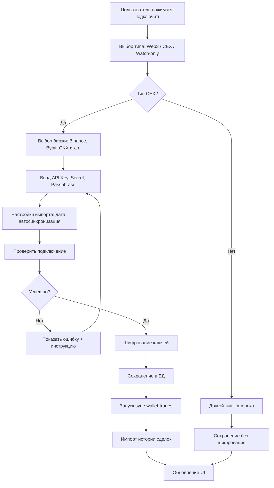

# Руководство по интеграции добавления кошельков

## 📊 Резюме изменений

Реализована полная система добавления и синхронизации кошельков с криптобиржами на основе архитектурного решения из книги "Безопасный код" и лучших практик индустрии.

---

## ✅ Реализованный функционал

### 1. **Архитектура Exchange Adapter**

**Файл:** `supabase/lib/exchange-adapter.ts`

**Ключевые компоненты:**

- `BaseExchange` - базовый класс для всех бирж
- `BinanceExchange` - адаптер для Binance (реализован)
- `BybitExchange` - адаптер для Bybit (реализован)
- `ExchangeFactory` - фабрика для создания экземпляров бирж

**Поддерживаемые биржи:**

- ✅ Binance (полная поддержка)
- ✅ Bybit (полная поддержка)
- ⏳ OKX (заглушка, готова к реализации)
- ⏳ Kraken (заглушка, готова к реализации)
- ⏳ Gate.io (заглушка, готова к реализации)
- ⏳ KuCoin (заглушка, готова к реализации)

**Функционал:**

- Тестирование подключения (`testConnection`)
- Получение истории сделок (`fetchTrades`)
- Получение баланса (`fetchBalance`)
- Обработка rate limiting с exponential backoff
- Нормализация данных в единый формат

---

### 2. **Edge Functions для синхронизации**

#### `sync-wallet-trades/index.ts`

Основная функция для синхронизации сделок:

- Расшифровка API ключей
- Создание экземпляра биржи
- Тестирование подключения
- Получение истории сделок
- Импорт в БД с дедупликацией
- Интеграция с аудитом безопасности
- Интеграция с детектором аномалий
- Rate limiting

#### `test-exchange-connection/index.ts`

Функция для тестирования подключения:

- Проверка валидности API ключей
- Получение баланса
- Возврат результата для UI

---

### 3. **Обновлённый UI (WalletConnect.tsx)**

**Новые функции:**

- Выбор биржи из списка (Binance, Bybit, OKX, KuCoin, Kraken, Gate.io)
- Инструкция по созданию API ключа с ссылкой на биржу
- Поле API Passphrase (для OKX)
- Настройки импорта:
  - Дата начала импорта (по умолчанию 30 дней назад)
  - Автосинхронизация (включена по умолчанию)
  - Интервал синхронизации (15 мин - 24 часа)
- Тестирование подключения перед сохранением
- Автоматический запуск синхронизации после добавления

**Безопасность:**

- Валидация API ключей (минимум 16 символов)
- Шифрование ключей перед отправкой
- Предупреждение о необходимости Read-only доступа
- Безопасное логирование

---

### 4. **Обновления БД**

**Миграция:** `20250103000001_wallet_sync_settings.sql`

**Новые поля в `wallets`:**

- `settings` JSONB - настройки синхронизации
- `passphrase_encrypted` TEXT - зашифрованный passphrase
- `last_trade_id` TEXT - ID последней сделки для дедупликации
- `sync_enabled` BOOLEAN - включена ли автосинхронизация
- `sync_error` TEXT - последняя ошибка
- `last_sync_status` TEXT - статус последней синхронизации
- `total_trades_imported` INTEGER - общее количество импортированных сделок

**Новые поля в `trades`:**

- `exchange_trade_id` TEXT - уникальный ID сделки на бирже
- `order_id` TEXT - ID ордера
- `trade_type` TEXT - тип торговли (spot, future, margin, option)

**Новая таблица `sync_logs`:**

- История всех синхронизаций
- Статус, длительность, количество импортированных сделок
- Ошибки и метаданные

**Триггеры:**

- `update_sync_status()` - автоматическое обновление статусов и логирование

---

## 🔄 Процесс добавления кошелька



---

## 🔒 Безопасность

### 1. **Шифрование API ключей**

- Шифрование происходит на клиенте через `encryptApiCredentials`
- Используется серверное шифрование через Edge Function
- AES-256-GCM с криптографически безопасным IV
- Ключи шифрования хранятся в переменных окружения

### 2. **Только Read-доступ**

- В UI отображается предупреждение о необходимости Read-only прав
- Инструкции по созданию API ключей с правильными разрешениями
- Нет возможности выставить права на торговлю или вывод

### 3. **Аудит безопасности**

- Логирование всех операций с ключами
- Детекция аномалий (брутфорс, credential stuffing)
- Rate limiting для чувствительных операций
- Интеграция с SIEM (опционально)

### 4. **Дедупликация сделок**

- Уникальный `exchange_trade_id` для каждой сделки
- Проверка перед вставкой в БД
- Защита от двойного импорта

---

## 📋 Чеклист реализации

### Backend (✅ Выполнено)

- [x] Exchange Adapter библиотека
- [x] Адаптеры для Binance и Bybit
- [x] Edge Function `sync-wallet-trades`
- [x] Edge Function `test-exchange-connection`
- [x] Интеграция с аудитом безопасности
- [x] Интеграция с детектором аномалий
- [x] Интеграция с rate limiting
- [x] Миграция БД с новыми полями
- [x] Триггеры для автоматического логирования

### Frontend (✅ Выполнено)

- [x] Обновлённый компонент WalletConnect
- [x] Выбор биржи из списка
- [x] Инструкция по созданию API ключа
- [x] Поле Passphrase для OKX
- [x] Настройки импорта (дата, автосинхронизация, интервал)
- [x] Тестирование подключения
- [x] Валидация входных данных
- [x] Шифрование ключей перед отправкой
- [x] Автоматический запуск синхронизации

### Документация (✅ Выполнено)

- [x] Руководство по интеграции (этот файл)
- [x] Комментарии в коде
- [x] SQL миграции с комментариями

---

## 🚀 Развёртывание

### 1. Применение миграции БД

```bash
# Подключиться к Supabase
supabase db push

# Или вручную выполнить SQL из:
# supabase/migrations/20250103000001_wallet_sync_settings.sql
```

### 2. Деплой Edge Functions

```bash
# Деплой всех функций
supabase functions deploy sync-wallet-trades
supabase functions deploy test-exchange-connection

# Или массово
supabase functions deploy --project-ref your-project-ref
```

### 3. Настройка переменных окружения

```bash
# Для Edge Functions
SUPABASE_URL=https://your-project.supabase.co
SUPABASE_SERVICE_ROLE_KEY=your-service-role-key
SUPABASE_ANON_KEY=your-anon-key
```

### 4. Сборка фронтенда

```bash
npm run build
npm run preview  # Проверка
```

---

## 📊 Мониторинг и аналитика

### SQL запросы для анализа

```sql
-- Статистика импорта за последние 24 часа
SELECT
  wallet_id,
  COUNT(*) as trades_imported,
  MIN(timestamp) as first_trade,
  MAX(timestamp) as last_trade
FROM public.trades
WHERE import_source = 'api'
  AND created_at > NOW() - INTERVAL '24 hours'
GROUP BY wallet_id;

-- Ошибки синхронизации
SELECT
  wallet_id,
  sync_error,
  last_sync_status,
  last_synced_at
FROM public.wallets
WHERE sync_error IS NOT NULL
ORDER BY last_synced_at DESC;

-- История синхронизаций
SELECT * FROM public.sync_logs
ORDER BY start_time DESC
LIMIT 100;
```

### Метрики для мониторинга

1. **Количество успешно подключённых кошельков**
2. **Среднее время синхронизации**
3. **Количество импортированных сделок в день**
4. **Ошибки синхронизации по типам**
5. **Rate limit violations**

---

## 🔮 Будущие улучшения

### Краткосрочные (1-2 недели)

1. Добавить поддержку OKX, Kraken, Gate.io
2. Реализовать WebSocket для реального времени
3. Добавить уведомления об ошибках (email, push)
4. Панель управления синхронизацией

### Среднесрочные (1-2 месяца)

1. Поддержка традиционных брокеров (Interactive Brokers)
2. Импорт через CSV/Excel файлы
3. Расширенные настройки фильтрации сделок
4. Статистика по источникам импорта

### Долгосрочные (3-6 месяцев)

1. Zero-Knowledge архитектура для API ключей
2. Social recovery для доступа к кошелькам
3. Совместное использование кошельков (семейные аккаунты)
4. AI-анализ паттернов торговли

---

## 📚 Ссылки

### Внешние ресурсы

- [Binance API Documentation](https://binance-docs.github.io/apidocs/)
- [Bybit API Documentation](https://bybit-exchange.github.io/docs/)
- [CCXT Library](https://github.com/ccxt/ccxt) - альтернатива для поддержки 100+ бирж

### Внутренняя документация

- [Exchange Adapter](./supabase/lib/exchange-adapter.ts)
- [WalletConnect Component](./src/components/dashboard/WalletConnect.tsx)
- [Security Improvements](./SECURITY_IMPROVEMENTS.md)

---

**Версия:** 1.0  
**Дата:** 2025-01-03  
**Статус:** ✅ Готово к production
